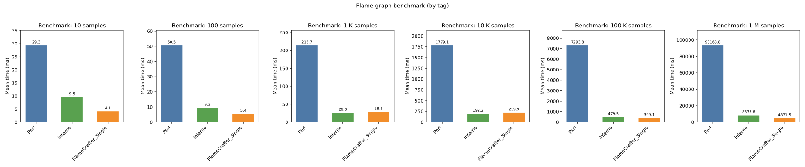

A **C++17-powered** tool to generate beautiful, high-performance flamegraphs from `perf` or DTrace stack samples – **no more Perl**, no more slow [perl scripts](https://github.com/brendangregg/FlameGraph)!


## ✨ Key Features

✅ **Header-only C++ Library**  
No complex build steps or dependencies – just include and go!

✅ **Modern C++17 Implementation**  
Using `std::string_view`, parallel algorithms, and efficient data structures.

✅ **Parallel Flamegraph Building**  
Powered by [Intel TBB](https://github.com/oneapi-src/oneTBB)(if TBB avaliable), scales well on multi-core machines.

✅ **Beautiful SVG/HTML Output**  
No need for ancient Perl scripts – produce clean, colorful, and scalable flamegraph visualizations.

✅ **Supports perf and DTrace**  
Parse stack samples from multiple sources and render instantly.

✅ **Open and Extensible**  
Easily integrate into your own tools or extend to support new profile formats.


## 📦 Installation

Since it's header-only, just copy the `include/` folder into your project:

```bash
cp -r include/ your_project/
````


## 🚀 Usage

The typical workflow:

- **Collect stack samples** (with `perf` or `dtrace`)
- **Generate parsed stacks** (with `perf script`, for example)
- **Build flamegraph**:

```cpp
#include "flamegraph.hpp"

using namespace flamegraph;
    
int main(int argc, char* argv[]) {
    FlameGraphConfig config;
    config.title = "Performance Test Flame Graph";
    config.interactive = true;
    config.write_folded_file = false;

    FlameGraphGenerator generator(config);
    generator.generate_from("perf.parsed", "my_flamegraph.svg");
    generator.generate_from("perf.parsed", "my_flamegraph.html");	// generate .html
    return 0;
}
```


🔥 **Parallel rendering** is enabled by default if `TBB` is available. All you need is to use `ParallelFlameGraphGenerator` instead if `FlameGraphGenerator`

```cpp
#include "parallel_flamegraph.hpp"

using namespace flamegraph;

int main(int argc, char* argv[]) {
    FlameGraphConfig config;
    config.title = "Performance Test Flame Graph";
    config.interactive = true;
    config.write_folded_file = false;

    ParallelFlameGraphGenerator generator(config);
    generator.generate_from("perf.parsed", "my_flamegraph.svg");
    generator.generate_from("perf.parsed", "my_flamegraph.html");	// generate .html
    return 0;
}
```

`ParallelFlameGraphGenerator` depends on `TBB` so do not forget to link with `tbb` by LINK_FLAG `-ltbb`


## ⚡ Performance

<div align="center">
  
</div>

| Dataset | Perl | inferno | FlameCrafter_Single | FlameCrafter_Parallel |
|--------:|------:|--------:|----------:|------------:|
|      10 |   15.8 |      4.1 |    **1.1** |          2.2 |
|     100 |   21.4 |      6.4 |    **3.0** |          5.0 |
|     1 K |   94.7 | **14.5** |       18.9 |         25.6 |
|    10 K |  772.0 | **91.6** |      180.0 |        128.6 |
|   100 K | 3738.3 | **186.5** |      993.4 |        488.6 |

Although not faster than [inferno](https://github.com/jonhoo/inferno) in large dataset, **FlameCrafter** offers:

* 🏗️ **Header-only simplicity** – no build, no external runtime
* 🎯 **C++17 efficiency** – tight memory usage and zero-cost abstractions
* 🔌 **Easily embeddable** – integrate directly into your C++ projects


## 📜 License

This project is licensed under the MIT License. See [LICENSE](LICENSE) for details.
